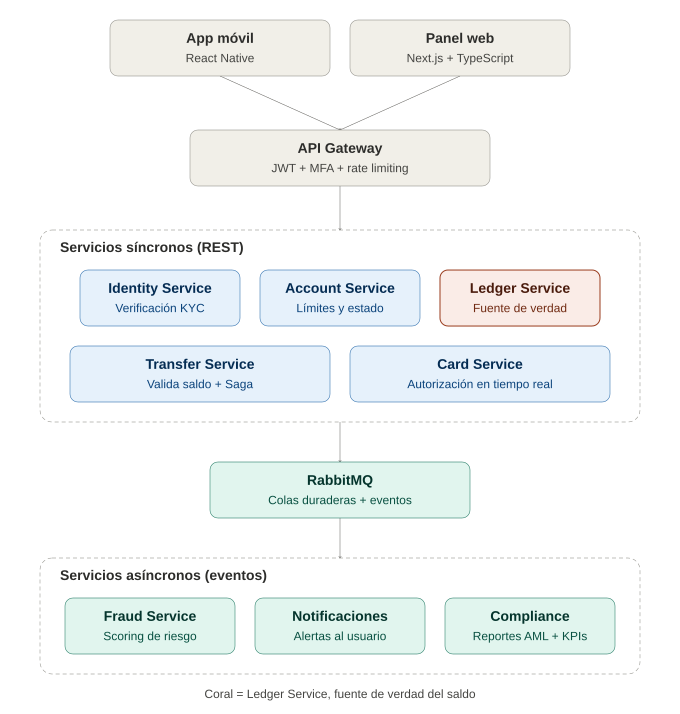
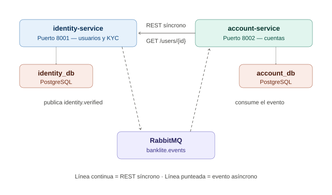

# BankLite — Identity Service y Account Service

Implementación de dos microservicios de la plataforma de banca digital **BankLite**, construidos
de forma autónoma, con persistencia propia por servicio y comunicación **síncrona (REST)** y
**asíncrona (eventos sobre RabbitMQ)** entre ellos.

## Arquitectura





### Los dos microservicios

| Servicio | Puerto | Responsabilidad única | Base de datos |
|---|---|---|---|
| `identity-service` | 8001 | Registro de usuarios y verificación KYC contra un proveedor externo | `identity_db` (PostgreSQL) |
| `account-service` | 8002 | Apertura y administración de cuentas con límites regulatorios por país | `account_db` (PostgreSQL) |

Cada servicio tiene **su propia base de datos** y ninguno accede a las tablas del otro
(*database per service*). El único punto de contacto entre ellos son la API REST y el bus de eventos.

### Comunicación síncrona (REST)

Antes de abrir una cuenta, `account-service` consulta el estado real del usuario llamando a
`GET /users/{id}` de `identity-service`. Si Identity no responde, la apertura devuelve `503` en
lugar de crear una cuenta sobre información no verificada.

```
account-service  ──── GET /users/{id} ────>  identity-service
                 <─── 200 { status: verified, country: CO } ───
```

### Comunicación asíncrona (eventos)

Cuando el proveedor KYC aprueba a un usuario, `identity-service` publica el evento
`identity.verified` en el exchange `banklite.events`. `account-service` lo consume desde la cola
`account.identity-verified` y alimenta una proyección local (`verified_users`), sin bloquear
el proceso de verificación.

```
identity-service ──publish identity.verified──> [banklite.events] ──> [account.identity-verified] ──> account-service
```

Configuración exigida por el dominio financiero: exchange y cola **durables**, mensajes
**persistentes** (`delivery_mode=2`) y **confirmaciones de entrega explícitas**
(*publisher confirms*) para no perder eventos.

Puedes ver la evidencia del consumo con `GET /verified-users` en el puerto 8002: esa tabla
**solo** se llena a través del evento.

## Cómo ejecutarlo en local

Requisitos: Docker Desktop.

```bash
docker compose up --build
```

Eso levanta cinco contenedores: dos PostgreSQL (uno por servicio), RabbitMQ y los dos microservicios.

| Recurso | URL |
|---|---|
| Identity Service (Swagger) | http://localhost:8001/docs |
| Account Service (Swagger) | http://localhost:8002/docs |
| Panel de RabbitMQ | http://localhost:15672 (usuario `banklite`, clave `banklite`) |

Para detener todo:

```bash
docker compose down          # conserva los datos
docker compose down -v       # borra también las bases de datos
```

### Prueba de humo automática

```powershell
powershell -ExecutionPolicy Bypass -File .\scripts\smoke_test.ps1
```

Recorre todos los endpoints, valida los códigos HTTP y comprueba que el evento asíncrono llegó.

## Endpoints

### Identity Service — `http://localhost:8001`

#### `POST /users` — registrar usuario

```json
// Petición
{ "email": "juan@example.com", "phone": "+573001234567", "country": "CO" }
```

```json
// Respuesta 201
{
  "id": "31b0e5f5-4b50-4b80-aa49-ccc197344776",
  "email": "juan@example.com",
  "phone": "+573001234567",
  "country": "CO",
  "status": "pending_verification",
  "created_at": "2026-09-15T22:23:23.043816Z"
}
```

Errores: `409` si el email ya existe, `422` si los datos no pasan validación.

#### `GET /users/{id}` — consultar usuario

Este es el endpoint que `account-service` llama de forma **síncrona**. Devuelve `200` o `404`.

#### `GET /users?status=&limit=&offset=` — listar usuarios

Devuelve `200` con la lista paginada. El filtro `status` es opcional.

#### `POST /users/{id}/kyc` — verificar identidad

```json
// Petición
{ "document_type": "cedula", "document_number": "1098765432" }
```

```json
// Respuesta 200
{
  "kyc": {
    "id": "e520859c-a68f-459e-b15f-d744f5694b6b",
    "user_id": "31b0e5f5-4b50-4b80-aa49-ccc197344776",
    "document_type": "cedula",
    "document_last4": "5432",
    "verification_status": "approved",
    "provider_reference": "KYC-4A2C44B6B143",
    "created_at": "2026-09-15T22:23:23.043816Z"
  },
  "user_status": "verified",
  "event_published": true,
  "event_name": "identity.verified"
}
```

Errores: `404` si el usuario no existe, `409` si ya estaba verificado, `422` si el documento es inválido.

> El proveedor KYC está simulado de forma determinista: cualquier documento que termine en `0000`
> se rechaza, el resto se aprueba. Así se pueden demostrar los dos caminos sin depender de un tercero real.

#### `GET /users/{id}/kyc` — historial de verificaciones

Devuelve `200` con la lista de intentos, o `404` si el usuario no existe.

### Account Service — `http://localhost:8002`

#### `POST /accounts` — abrir cuenta

```json
// Petición
{ "user_id": "31b0e5f5-4b50-4b80-aa49-ccc197344776" }
```

```json
// Respuesta 201
{
  "account": {
    "id": "cb862923-14e6-4d15-868a-1db7766eed5b",
    "user_id": "31b0e5f5-4b50-4b80-aa49-ccc197344776",
    "status": "active",
    "currency": "COP",
    "country": "CO",
    "daily_limit": "5000000.00",
    "monthly_limit": "50000000.00",
    "created_at": "2026-09-15T22:23:23.397526Z"
  },
  "validated_via": "identity-service (REST sincrono)",
  "event_projection_hit": true
}
```

Errores: `404` si el usuario no existe en Identity, `409` si no pasó el KYC o si ya tiene cuenta en
esa moneda, `400` si el país no está habilitado o la moneda no corresponde, `503` si Identity no responde.

#### `GET /accounts?user_id=` — listar cuentas

#### `GET /accounts/{id}` — consultar una cuenta (`200` / `404`)

#### `PATCH /accounts/{id}/status` — cambiar estado

```json
// Petición
{ "status": "suspended" }
```

Valores permitidos: `active`, `suspended`, `closed`. Una cuenta `closed` no puede volver a cambiar de estado (`409`).

#### `GET /verified-users` — evidencia de la comunicación asíncrona

Muestra la proyección local alimentada exclusivamente por el evento `identity.verified`.

## Límites regulatorios por país

`account-service` asigna los límites según el país del usuario, tal como exige el diseño de BankLite:

| País | Moneda | Límite diario | Límite mensual |
|---|---|---|---|
| CO | COP | 5.000.000 | 50.000.000 |
| MX | MXN | 20.000 | 200.000 |
| US | USD | 2.500 | 25.000 |
| ES | EUR | 2.000 | 20.000 |
| PE | PEN | 8.000 | 80.000 |

Un país fuera de esta tabla produce `400`.

## Modelo de datos

**identity_db**

- `users` — `id`, `email` (único), `phone`, `country`, `status`, `created_at`
- `kyc_records` — `id`, `user_id`, `document_type`, `document_hash`, `document_last4`,
  `verification_status`, `provider_reference`, `created_at`

El número de documento nunca se guarda en claro: se almacena su hash SHA-256 y solo los últimos
cuatro dígitos quedan visibles.

**account_db**

- `accounts` — `id`, `user_id`, `status`, `currency`, `country`, `daily_limit`, `monthly_limit`,
  `created_at`. Restricción única sobre `(user_id, currency)`.
- `verified_users` — proyección alimentada por el evento asíncrono.

## Manejo de errores

| Código | Cuándo se devuelve |
|---|---|
| `200` | Consulta o actualización exitosa |
| `201` | Recurso creado |
| `400` | Regla de negocio incumplida (país no habilitado, moneda incorrecta) |
| `404` | El recurso no existe |
| `409` | Conflicto de estado (email duplicado, cuenta duplicada, KYC pendiente o repetido) |
| `422` | Validación de entrada fallida |
| `503` | Una dependencia síncrona no está disponible |
| `500` | Error no controlado, capturado por un manejador global |

## Tecnologías

- **Python 3.12** con **FastAPI** — documentación OpenAPI automática en `/docs`
- **SQLAlchemy 2.0** como ORM y **PostgreSQL 16** como motor
- **Pydantic v2** para validación de entrada y serialización
- **RabbitMQ 3.13** para la mensajería asíncrona, con **pika**
- **httpx** para la comunicación síncrona entre servicios
- **Docker Compose** para levantar todo el entorno local

## Estructura del proyecto

```
.
├── docker-compose.yml
├── README.md
├── scripts/
│   └── smoke_test.ps1
└── services/
    ├── identity-service/
    │   ├── Dockerfile
    │   ├── requirements.txt
    │   └── app/
    │       ├── main.py          # arranque de FastAPI y manejadores de error
    │       ├── config.py        # configuración por variables de entorno
    │       ├── database.py      # motor y sesión de SQLAlchemy
    │       ├── models.py        # tablas users y kyc_records
    │       ├── schemas.py       # validación de entrada y salida
    │       ├── kyc_provider.py  # proveedor KYC externo simulado
    │       ├── events.py        # publicación de identity.verified
    │       └── routers/
    │           └── users.py     # endpoints
    └── account-service/
        ├── Dockerfile
        ├── requirements.txt
        └── app/
            ├── main.py
            ├── config.py
            ├── database.py
            ├── models.py           # tablas accounts y verified_users
            ├── schemas.py
            ├── limits.py           # límites regulatorios por país
            ├── identity_client.py  # cliente REST síncrono
            ├── consumer.py         # consumidor de RabbitMQ
            └── routers/
                └── accounts.py
```
# banklite-microservicios

